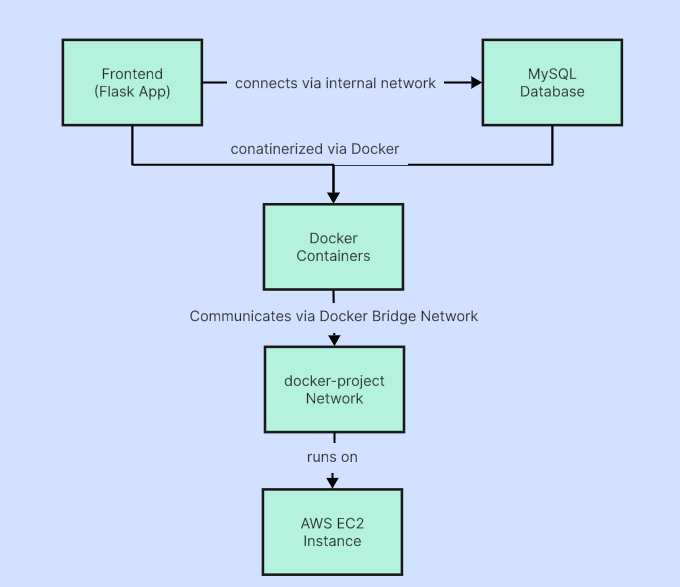

# 📦 Docker Project: Two-Tier Flask Application with MySQL (Dockerized on AWS EC2)

This project demonstrates a production-ready two-tier web application using Flask (Python) as the application layer and MySQL as the database layer, fully containerized with Docker and deployed on an AWS EC2 instance.

## 🌟 Key Features

- **Containerized Architecture**: Flask app and MySQL in separate Docker containers
- **Docker Networking**: Custom bridge network for secure inter-container communication
- **Data Persistence**: Docker volumes for MySQL data storage
- **AWS Deployment**: Ready for cloud deployment on EC2 instances
- **Environment Variables**: Secure configuration management
- **Production-Ready**: Follows best practices for containerized applications

## 🏗️ Architecture Overview


##   Getting Started

### Prerequisites

- Docker installed on your system
- AWS account (for EC2 deployment)
- Basic understanding of Docker and Flask

### Project Structure

docker-project/
├── templates/             # Flask templates
├── .gitignore             # Git ignore rules
├── app.py                 # Flask application
├── docker-compose.yml     # Docker compose config
├── Dockerfile             # Single-stage Dockerfile
├── Dockerfile-multistage  # Multi-stage Dockerfile
├── dummy.txt              
├── Makefile               # Build automation
├── message.sql            # Database schema
├── README.md              # This file
└── requirements.txt       # Python dependencies

## 🛠️ Installation & Deployment

### 1. Local Development Setup

```bash
# Clone the repository
git clone <your-repo-url>
cd two-tier-flask-app

# Create custom Docker network
docker network create docker-project -d bridge

# Start MySQL container with persistent volume
docker run -d --name mysql --network docker-project \
  -e MYSQL_ROOT_PASSWORD=root \
  -e MYSQL_DATABASE=devops \
  -v mysql-data:/var/lib/mysql \
  mysql:latest

# Build Flask application image
docker build -t docker-project:latest .

# Run Flask container connected to MySQL
docker run -d -p 5000:5000 --network docker-project \
  -e MYSQL_HOST=mysql \
  -e MYSQL_USER=root \
  -e MYSQL_PASSWORD=root \
  -e MYSQL_DB=devops \
  docker-project:latest
```

### 2. AWS EC2 Deployment

1. **Launch EC2 Instance**:
   - AMI: Ubuntu 24.04 LTS
   - Instance Type: t2.micro or larger
   - Security Group: Allow ports 22 (SSH) and 5000 (Flask)

2. **Connect to EC2 Instance**:
```bash
chmod 400 your-key.pem
ssh -i "your-key.pem" ubuntu@<EC2-Public-IP>
```

3. **Install Docker**:
```bash
sudo apt update
sudo apt install -y docker.io
sudo systemctl start docker
sudo systemctl enable docker
```

4. **Deploy Application**:
   - Follow the same steps as local development setup

## 🔍 Verifying the Deployment

### Check Running Containers
```bash
docker ps
```

### Verify Database Content
```bash
docker exec -it mysql bash
mysql -u root -p
```
```sql
USE devops;
SELECT * FROM messages;
```

Expected Output:
```
+----+---------+
| id | message |
+----+---------+
| 1  | Hello   |
| 2  | I       |
| 3  | am      |
| 4  | Pranay  |
+----+---------+
```

## 🌐 Accessing the Application

Once deployed, access the Flask application at:
```
http://<EC2-Public-IP>:5000
```

## 🔧 Configuration Options

| Environment Variable | Description                          | Default Value |
|-----------------------|--------------------------------------|---------------|
| MYSQL_HOST            | MySQL container hostname             | mysql         |
| MYSQL_USER            | MySQL username                       | root          |
| MYSQL_PASSWORD        | MySQL password                       | root          |
| MYSQL_DB              | MySQL database name                  | devops        |

## 🛡️ Security Considerations

1. **Never use root credentials in production**
2. **Implement proper firewall rules** on EC2
3. **Use SSL/TLS** for all connections
4. **Regularly update** Docker images and packages

## 📚 Technical Details

### Docker Networking
- Custom bridge network `docker-project` isolates the application containers
- Containers communicate using internal DNS (mysql hostname)

### Data Persistence
- MySQL data is stored in a Docker volume (`mysql-data`)
- Volume persists between container restarts

### Multi-stage Building
- The project includes both single-stage and multi-stage Dockerfiles
- Multi-stage builds reduce final image size

## 🤝 Contributing

Contributions are welcome! Please fork the repository and submit a pull request.

## 📞 Contact

Maintained by Pranay  
For support or questions, please open an issue in the repository.
